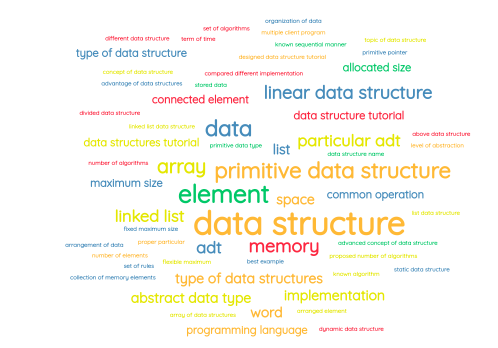

  

  

   

   

   

## Author

Mansoor Ahmed

- [github.com/mansoormemon](https://github.com/mansoormemon)

## License

This product is distributed under the [Apache License, Version 2.0](https://www.apache.org/licenses/LICENSE-2.0).
